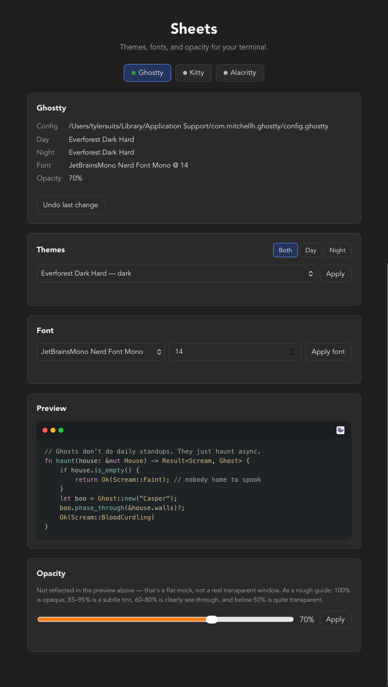
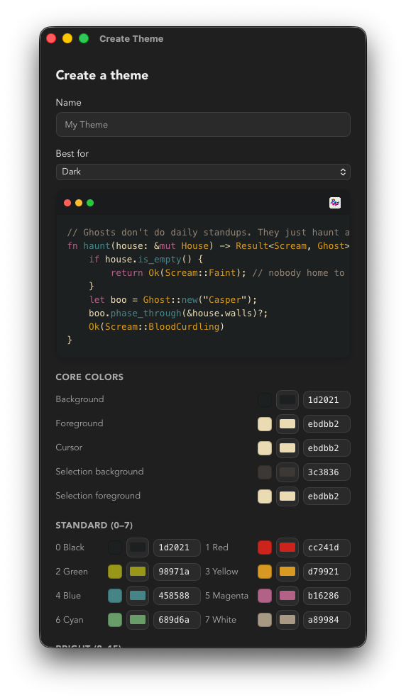

<p align="center">
  
</p>

# Sheets

A desktop app for managing terminal themes, fonts, and opacity across
Ghostty, Kitty, and Alacritty — with color-wheel pickers, live preview, and
theme export for sharing your own creations.

## Status

Functional and in daily use on macOS. Linux (Omarchy) is supported in code —
all three adapters use standard XDG config paths — but hasn't been verified
on a real machine yet.

## Screenshots

<p align="center">
  
  
</p>

## Features

- Live theme picker: ~460 imported Ghostty built-ins, plus your own, in one
  searchable dropdown, with a live syntax-highlighted preview
- Color wheel / HEX input for foreground, background, and palette colors
- Create a theme by hand, or edit whatever theme is currently applied — an
  edit to a pre-installed theme always saves as a separate theme, never
  overwriting the original
- Import a `sheets-theme.json` via File > Import Theme… or macOS
  "Open With > Sheets"; export your own the same way
- Day / Night / Both theme designation per app
- Font family + size picker (reads installed system fonts)
- Opacity slider
- One-level undo for the last change made to any app's config
- Manually locate a config file if Sheets can't auto-detect one
- Help menu: check for updates, links to this repo and tylersuits.com,
  and a contact address
- Supports Ghostty, Kitty, and Alacritty (Alacritty via a TOML adapter,
  the other two via flat key-value config parsing)
- Distributed via GitHub Releases

## Theme repo format

File > Export Theme writes a user-created theme as `sheets-theme.json`, meant
to sit at the root of a git repo (or wherever you'd like to share it) so
others can pick it up:

```json
{
  "name": "Tokyo Night",
  "variant": "dark",
  "palette": {
    "background": "1a1b26",
    "foreground": "c0caf5",
    "cursor": "c0caf5",
    "selection_background": "283457",
    "selection_foreground": null,
    "ansi": [
      "15161e", "f7768e", "9ece6a", "e0af68",
      "7aa2f7", "bb9af7", "7dcfff", "a9b1d6",
      "414868", "f7768e", "9ece6a", "e0af68",
      "7aa2f7", "bb9af7", "7dcfff", "c0caf5"
    ]
  }
}
```

- `variant` is `"dark"`, `"light"`, or `"both"`.
- Colors are hex strings without a leading `#`.
- `ansi` is exactly 16 entries: the standard ANSI 0-15 order (black, red,
  green, yellow, blue, magenta, cyan, white, then the bright variants of
  each).
- `cursor`, `selection_background`, and `selection_foreground` are
  optional.

This is Sheets' own format, not a wrapper around an existing standard
(base16, iTerm color schemes, etc.).

## Stack

- [Tauri](https://tauri.app/) (Rust backend + web frontend, vanilla TS)
  for small, native cross-platform builds
- Reference app: [Ghostty](https://ghostty.org/) ([docs](https://ghostty.org/docs))

## Dev setup

```bash
npm install
npm run tauri dev
```

Recommended IDE setup: [VS Code](https://code.visualstudio.com/) +
[Tauri extension](https://marketplace.visualstudio.com/items?itemName=tauri-apps.tauri-vscode) +
[rust-analyzer](https://marketplace.visualstudio.com/items?itemName=rust-lang.rust-analyzer)
